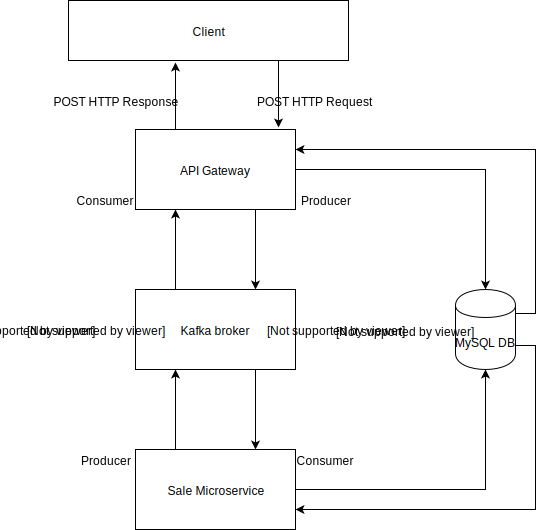

# Node-Kafka
    - Autor: Dennis Felipe Urtubia
    - Projeto final da disciplina de Sistemas Distribuidos 2019/2
    - Desenvolvimento de uma API de compra de produtos online

### Arquitetura do sistema

### Tecnologias utilizadas:
    - Nodejs;
    - Kafka;
    - MySQL;

### Funcionalidades a serem desenvolvidas
    - CRUD de Produtos;
    - Venda de produtos com cartão de crédito;
    - Após a API ser desenvolvida, disponibilizar o módulo de vendas como um micro serviço utilizando Kafka;

### Implementação
    - Endpoints numa API Rest para produtos e vendas;
    - Requisições de produtos são processadas na API;
    - Requisições de vendas são processadas num Microserviço:
        - As informações da compra são recebidas pelo corpo de uma requisição HTTP POST na API e:
            - Enviadas para o microserviço por meio de uma implementação Pub/Sub do Kafka no tópico 'card-module';
            - As informações da venda são validadas e processadas;
            - Por fim, o microserviço produz e envia uma mensagem de resposta no tópico 'card-module-response' contendo informações de sucesso/falha da venda. A API consome a mensagem produzida;
